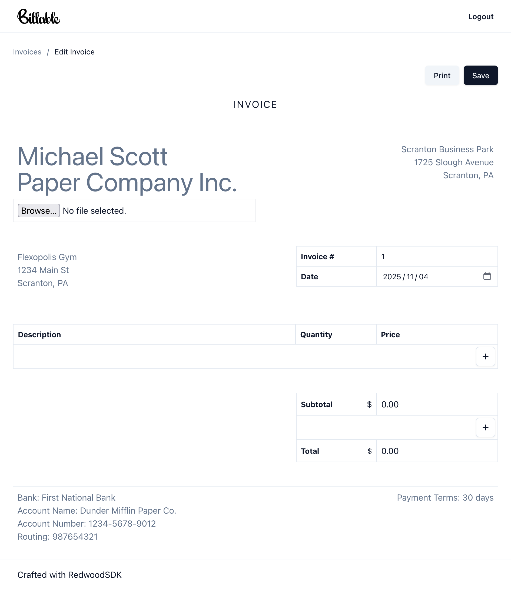

# Billable: Billing Made Simple. Period.

Billable is personal invoicing software that allows a user to input information about their business entity, the client, and items, quanitities and prices. It calculates the total, and includes the ability to add tax.

<a href="./screenshot.png" target="_blank"></a>

[](https://deploy.workers.cloudflare.com/?url=https://github.com/redwoodjs/example-billable.git)

## Features

- Upload logos
- Print to PDF
- User accounts via Passkey authentication
- Save invoices to Durable Objects

Built with RedwoodSDK.

## Installation

```bash
pnpm install
pnpm dev
```
